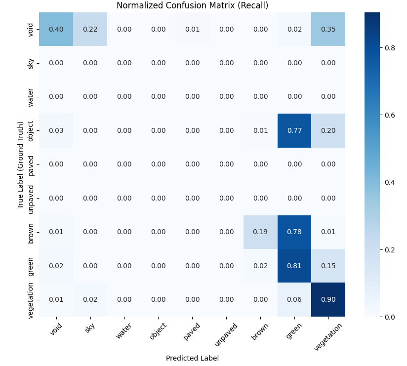

## 0004 帧前1000帧的评估

每一帧只使用第一张图，不进行贝叶斯更新。

```
=== 步骤 1: 准备 Ground Truth 数据 ===
正在加载 GT 地图 (Frames 0 - 1000, stride=1)...

=== 步骤 3: 全面评估 (Comprehensive Evaluation) ===
构建 KDTree (GT Points: 26215000)...
查询最近邻 (Pred Points: 5426699)...
匹配统计: 5426579 / 5426699 点匹配成功 (匹配率: 100.00%)

============================================================
评估详细报告 (Frames 0-1000)
============================================================
 ID       Name    IoU Precision Recall F1-Score  Support(GT)  Pred(Count)
  0       void 0.2554    0.4158 0.3983   0.4069       153408       146928
  1        sky 0.0000    0.0000      -        -            0        56332
  2      water 0.0000    0.0000      -        -            0          260
  3     object 0.0000    0.0000 0.0000        -         7173            5
  4      paved 0.0000    0.0000      -        -            0         3125
  5    unpaved      -         -      -        -            0            0
  6      brown 0.1590    0.4652 0.1946   0.2744       295328       123504
  7      green 0.7541    0.9149 0.8110   0.8598      4004174      3549562
  8 vegetation 0.5332    0.5650 0.9044   0.6955       966496      1546863
------------------------------------------------------------
Global Accuracy : 0.7813
Mean IoU        : 0.3616
Mean Accuracy   : 0.4775  <-- 关注这个! 若低说明小类由于不平衡被牺牲了
Mean F1-Score   : 0.4574
============================================================

正在绘制混淆矩阵热力图 (Row-Normalized: 显示真实类别的预测分布)...
```
